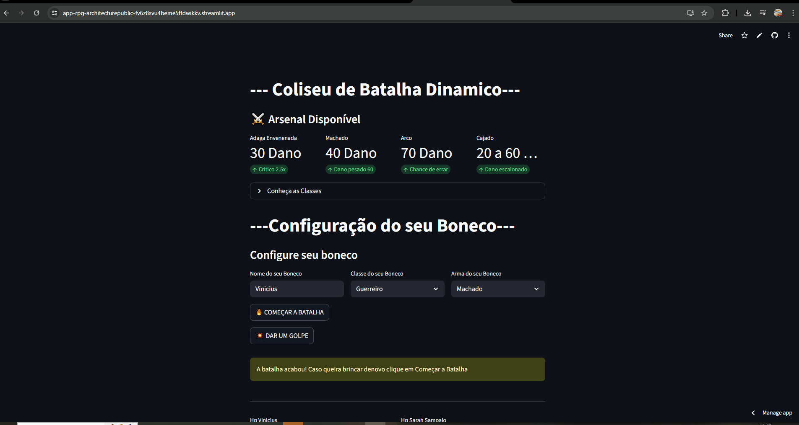

# ⚔️ Coliseu de Batalha Dinâmico

<div align="center">


**🎮 [DEMO AO VIVO](https://app-rpg-architecturepublic-fv6z8svu4beme5tfdwikkv.streamlit.app/) 🎮**

*Simulador de batalhas RPG com POO avançada e analytics em tempo real*

</div>

---

## 📸 Preview



---

## 🎯 Sobre o Projeto

Este é um **simulador de batalhas RPG** desenvolvido em Python com foco em:
- 🏗️ **Arquitetura de Software**: Separação clara entre lógica de negócio e interface
- 🎨 **POO Avançada**: Classes abstratas, herança e polimorfismo
- 📊 **Data Analytics**: Persistência em CSV e visualização com Pandas
- 🎮 **UX Interativa**: Interface responsiva com Streamlit

> 📢 **Update (Jan/2026)**: Módulo de Analytics adicionado! Dashboard automático com histórico de batalhas e estatísticas.

---

## ✨ Funcionalidades

### 🎭 Sistema de Personagens
- **3 Classes Jogáveis**: Guerreiro, Tank e Mago
- **4 Armas Únicas**: Machado, Arco, Cajado e Adaga Envenenada
- **Sistema de Proficiência**: Cada classe tem armas favoritas e penalidades

### ⚔️ Mecânica de Combate
- **Combate por Turnos**: Sistema estratégico de ação/reação
- **Dano Variável**: Críticos, chances de erro e escalabilidade
- **Log Detalhado**: Histórico completo da batalha em tempo real

### 📊 Analytics & Persistência
- **ETL Simplificado**: Captura, armazena e visualiza dados de batalha
- **Dashboard Automático**: Gráficos de performance e estatísticas
- **Histórico em CSV**: Base de dados local persistente

### 🤖 NPC Inteligente
- **Nomes Reais**: Geração via biblioteca Faker
- **Combinações Aleatórias**: Classe e arma randomizadas
- **Dificuldade Balanceada**: Sistema de balanceamento de poder

---

## 🛠️ Stack Tecnológico

| Tecnologia | Uso |
|------------|-----|
|  | Linguagem principal |
|  | Framework de interface |
|  | Análise de dados |
|  | Geração de dados |

---

## 🚀 Como Executar

### Pré-requisitos
- Python 3.11 ou superior
- pip (gerenciador de pacotes)

### Instalação

1. **Clone o repositório**
```bash
git clone https://github.com/Renanmrqs/Streamlit-RPG-Architecture.git
cd Streamlit-RPG-Architecture
```

2. **Crie um ambiente virtual (recomendado)**
```bash
# Windows
python -m venv venv
.\venv\Scripts\activate

# Linux/Mac
python3 -m venv venv
source venv/bin/activate
```

3. **Instale as dependências**
```bash
pip install -r requirements.txt
```

4. **Execute a aplicação**
```bash
streamlit run main.py
```

5. **Acesse no navegador**
```
http://localhost:8501
```

---

## 📂 Estrutura do Projeto

```
Streamlit-RPG-Architecture/
│
├── main.py                    # Interface Streamlit (Frontend)
├── herois.py                  # Classes de personagens e armas (Backend)
├── inimigos.py               # (Reservado para expansões futuras)
│
├── historico_batalhas.csv    # Base de dados de batalhas
├── requirements.txt          # Dependências do projeto
├── demo.gif                  # Preview animado
└── README.md                 # Documentação
```

---

## 🧠 Conceitos de Engenharia de Software Aplicados

### 1. Programação Orientada a Objetos (POO)

**Classes Abstratas (ABC)**
```python
class Personagem(ABC):
    @abstractmethod
    def atacar(self):
        pass
    
    @abstractmethod
    def defesa(self, dano_inimigo):
        pass
```

**Herança e Polimorfismo**
```python
class Guerreiro(Personagem):
    def atacar(self):
        # Implementação específica
        return dano_base

class Mago(Personagem):
    def atacar(self):
        # Implementação diferente
        return dano_magico
```

### 2. Gestão de Estado (Session State)
```python
st.session_state.player = classes[classe_usuario](nome, arma)
st.session_state.npc = classe_npc(nome_aleatorio, arma_npc)
st.session_state.log = []
```
Persistência de objetos na memória durante a sessão do usuário.

### 3. Mapeamento Dinâmico
```python
armas = {'Machado': herois.machado, 'Arco': herois.arco}
classes = {'Guerreiro': herois.Guerreiro, 'Tank': herois.Tank}

# Instanciação dinâmica sem if/else
player = classes[classe_escolhida](nome, armas[arma_escolhida])
```

### 4. ETL Simplificado
```python
def salvar_historico(vencedor, perdedor, turnos):
    # Extract: Captura dados da batalha
    novo_dado = {'Vencedor': [vencedor], 'Perdedor': [perdedor], 'Turnos': [turnos]}
    
    # Transform: Converte para DataFrame
    df_novo = pd.DataFrame(novo_dado)
    
    # Load: Persiste em CSV
    df_novo.to_csv('historico_batalhas.csv', mode='a', header=False, index=False)
```

---

## 🎮 Mecânica de Jogo

### Sistema de Proficiência

| Classe | HP | Armas Fortes | Armas Fracas | Bônus Especial |
|--------|-------|--------------|--------------|----------------|
| **Guerreiro** | 120 | Machado, Arco, Adaga | Cajado | Equilibrado |
| **Tank** | 120 | Machado, Adaga | Cajado, Arco | +40% defesa |
| **Mago** | 100 | Cajado | Todas as outras | Dano mágico alto |

### Armas e Dano

| Arma | Dano Base | Mecânica Especial |
|------|-----------|-------------------|
| **Adaga Envenenada** | 30 | 50% chance de crítico 2.5x |
| **Machado** | 40 | 33% chance de dano pesado (60) |
| **Arco** | 70 | 66% chance de errar (0 dano) |
| **Cajado** | 20-60 | Dano escalonado aleatório |

---

## 🗺️ Roadmap (Próximas Features)

### Em Desenvolvimento 🚧
- [ ] **Persistência de NPCs Derrotados**: Hall da Fama de oponentes vencidos
- [ ] **Galeria de Classes**: Visualização detalhada de cada classe
- [ ] **Modo Arena**: Coliseu com NPCs fixos ao invés de aleatórios
- [ ] **Sistema de Level Up**: Personagens evoluem a cada vitória

### Planejado 📝
- [ ] **Multiplayer Local**: Dois jogadores em turnos alternados
- [ ] **Boss Fights**: Chefes especiais com mecânicas únicas
- [ ] **Customização de Personagem**: Skins e nomes de armas
- [ ] **Ranking Global**: Leaderboard de jogadores

### Melhorias Técnicas 🔧
- [ ] Testes Unitários (pytest)
- [ ] CI/CD com GitHub Actions
- [ ] Docker para deploy
- [ ] Banco de dados SQLite para persistência

---

## 📊 Analytics Dashboard

O projeto inclui um módulo de analytics que rastreia:
- **Vencedores mais frequentes**
- **Duração média das batalhas**
- **Taxa de vitória por classe**
- **Distribuição de armas utilizadas**

Todos os dados são salvos em `historico_batalhas.csv` e visualizados automaticamente na interface.

---

## 🤝 Contribuindo

Contribuições são bem-vindas! Para contribuir:

1. Fork o projeto
2. Crie uma branch para sua feature (`git checkout -b feature/NovaFeature`)
3. Commit suas mudanças (`git commit -m 'feat: Adiciona nova feature'`)
4. Push para a branch (`git push origin feature/NovaFeature`)
5. Abra um Pull Request

---

## 📝 Licença

Este projeto está sob a licença MIT. Veja o arquivo `LICENSE` para mais detalhes.

---

## 👨‍💻 Autor

**Renan Fernandes Marques**

[](https://www.linkedin.com/in/renan-fernandes-marques-554a992ab/)
[](https://github.com/Renanmrqs)
[](mailto:renanmarques1923@gmail.com)

---

## 🌟 Agradecimentos

- **Streamlit Community** pela documentação excelente
- **Python Brasil** pelo suporte e tutoriais
- Todos que testaram e deram feedback no projeto

---

<div align="center">

**⭐ Se gostou do projeto, deixe uma estrela! ⭐**

*Desenvolvido com 💙 por Renan Marques*

</div>
